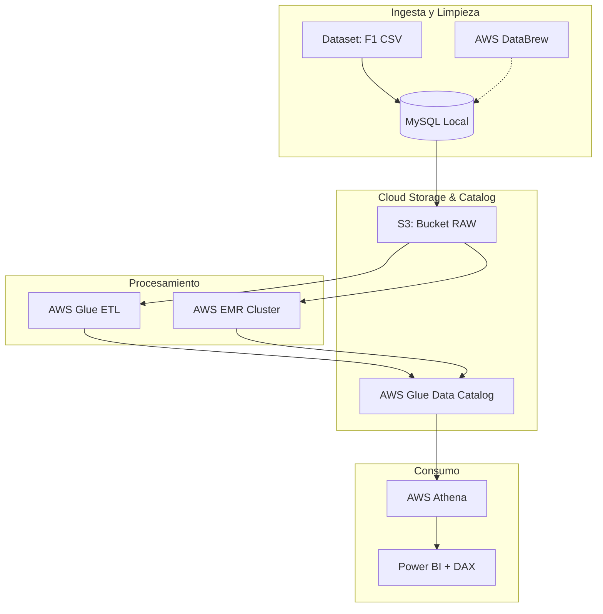

# F1 Cloud Data Pipeline: Extracción, Transformación y Carga (ETL) en AWS

## 📝 Resumen del Proyecto
Este proyecto consiste en el diseño e implementación de un flujo de datos de principio a fin (End-to-End) para el análisis estadístico de la Fórmula 1. El objetivo principal fue transformar un dataset histórico bruto en un modelo analítico capaz de extraer insights sobre el rendimiento de pilotos, escuderías y la evolución geográfica de los Grandes Premios a lo largo de 70 años.

> **Nota:** Este repositorio documenta la arquitectura técnica y los resultados del proyecto. Por motivos de optimización de costes, la infraestructura en AWS (EMR/Glue/S3) ha sido dada de baja tras la finalización del estudio.

## 🏗️ Arquitectura de la Solución

El flujo de datos sigue un modelo de *Data Lakehouse*, priorizando la escalabilidad y el desacoplamiento de componentes.

## 🛠️ Stack Tecnológico
* **Cloud:** AWS (S3, Glue, EMR, Athena, DataBrew).
* **Frameworks:** Apache Spark (PySpark), Python.
* **Bases de Datos:** MySQL.
* **Visualización:** Power BI (DAX).
* **Infraestructura:** IaC / Configuración manual vía consola AWS.

## 💡 Decisiones de Arquitectura: Contexto Académico vs. Profesional

Es fundamental aclarar la lógica detrás del stack tecnológico, ya que el proyecto combina requisitos académicos con buenas prácticas de ingeniería:

### 1. Uso de AWS EMR (Apache Spark)
* **Contexto:** El requerimiento académico original exigía el despliegue de un clúster EMR.
* **Análisis:** Soy consciente de que, para un dataset de un único CSV (volumen bajo), el despliegue de un clúster EMR representa una sobre-ingeniería innecesaria. Este ejercicio me permitió adquirir experiencia real en la gestión de nodos, configuración de YARN y optimización de jobs en entornos distribuidos.

### 2. Migración a AWS Glue (Enfoque Serverless)
* **Contexto:** Tras cumplir con la obligatoriedad académica, migré el flujo de procesamiento a **AWS Glue**.
* **Justificación:** Esta es la práctica estándar en la industria para este tipo de volúmenes de datos. Al ser una arquitectura *serverless*, eliminamos la gestión de infraestructura y pasamos a un modelo de "pago por uso". Esta comparativa me ha permitido entender cuándo escalar hacia clústeres (EMR) y cuándo priorizar la agilidad y el coste (Glue).

### 3. Estrategia de Gestión del Ciclo de Vida (FinOps)
* **Contexto:** En arquitecturas de Big Data, el almacenamiento suele ser un punto ciego de costes si no se gestiona proactivamente.
* **Implementación:** He implementado una política estricta de *Data Tiering* automatizada mediante **S3 Lifecycle Policies**.
* **Justificación:** Los datos se categorizan según su frecuencia de acceso. Los datos 'Hot' (recientemente ingeridos y procesados) residen en S3 Standard, mientras que los datos 'Cold' (históricos y de archivo de resultados) son migrados automáticamente a **S3 Glacier**. Esta práctica asegura la sostenibilidad económica del proyecto, eliminando el desperdicio de almacenamiento en objetos que no requieren latencia inmediata.

## Funcionalidades Principales
* **Limpieza de datos:** Uso de técnicas de *Data Profiling* con AWS DataBrew para detectar duplicados y anomalías.
* **Modelado:** Creación de dimensiones y tablas de hechos para permitir consultas complejas (ej. victorias por década, dominios de escuderías).
* **Análisis de Geo-datos:** Agrupación de Grandes Premios por continentes (desarrollado mediante lógica condicional en DAX).

## Resultados Visuales
* **Arquitectura de S3:** Estructura de buckets y segregación de zonas (Raw vs. Clean).
* **Transformaciones en Spark:** Muestra de tu código PySpark utilizado para la normalización de fechas.
* **Dashboard Power BI:** Visualización final con los KPIs de pilotos y escuderías.

## Documentación
La memoria técnica completa se puede consultar en el archivo [Memoria Técnica](ganadores_f1.docx.pdf).

